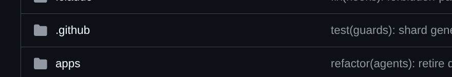

# Type to clipboard — a bottom typing bar for the Omarchy shell

Summon a minimal bar at the bottom of the screen from **anywhere**, type into it, press
Enter, and the text is on your clipboard. That's the whole plugin.

Multi-line included: Shift+Enter starts a new line, the bar grows with your text, and
what you typed is still there the next time you summon it — selected, so Enter re-copies
the last value or one keystroke replaces it.



## What it's for

The moments where you need to put something on the clipboard *without leaving what
you're doing*: pasting a value into a chat or a form from a note you're reading,
re-copying a snippet you keep using, or just parking a line of text for ten seconds
without opening an editor or a terminal.

- **Bottom-anchored, theme-aware** — styled from the Omarchy shell's popup tokens, so it
  follows your theme automatically.
- **Persistent field** — text survives between summons (`keepLoaded`), doubling as a
  one-item scratchpad. Reopening pre-selects the text: Enter copies it again, typing
  replaces it.
- **Multiline editor** — word-wrap, caret kept in view, grows up to 40% of the screen
  height.
- **Copy feedback** — a brief first-party OSD confirms the copy (`Copied` / `Copied N lines`).

## Is this for you?

| Requirement | Why |
|---|---|
| Omarchy with its Quickshell shell | The plugin runs inside `omarchy-shell` |
| `wl-clipboard` (`wl-copy`) | Puts the text on the Wayland clipboard |

No other services, no background daemons, no state on disk.

## Install

```bash
omarchy plugin add https://github.com/rawritude/omarchy-type-to-clipboard.git --enable
```

Then bind a key to summon it in `~/.config/hypr/bindings.lua`:

```lua
o.bind("SUPER + PERIOD", "Type to clipboard",
  "omarchy-shell shell toggle io.github.rawritude.typing")
```

## Using it

| Action | Result |
|---|---|
| Summon with your key | Bar appears at the bottom, focused, previous text selected |
| **Enter** | Copies to clipboard, shows the OSD, closes |
| **Shift+Enter** | New line |
| **Escape** / click outside | Closes, keeping the text for next time |

Clipboard history still works as usual — this bar is for the *forward* direction: putting
text onto the clipboard that isn't in an app yet.

### Scripting it

```bash
# Summon pre-filled
omarchy-shell shell summon io.github.rawritude.typing '{"text":"git push --force-with-lease"}'

# Clear the field (open or closed)
omarchy-shell -q io.github.rawritude.typing clear

# Read the current state
omarchy-shell io.github.rawritude.typing state
```

## Removing it

```bash
omarchy plugin remove io.github.rawritude.typing --yes
```

## License

[MIT](LICENSE)
